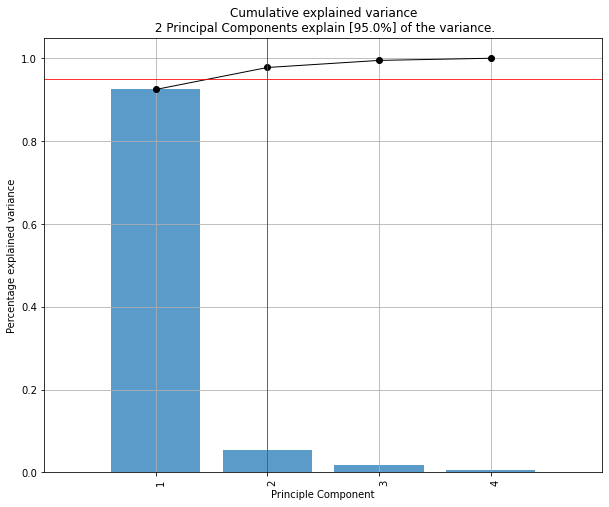
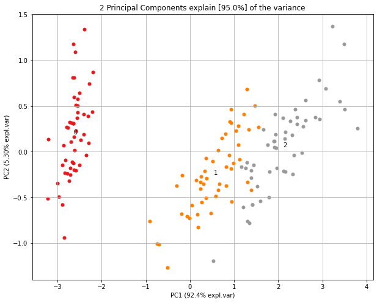
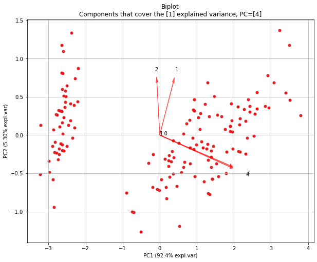
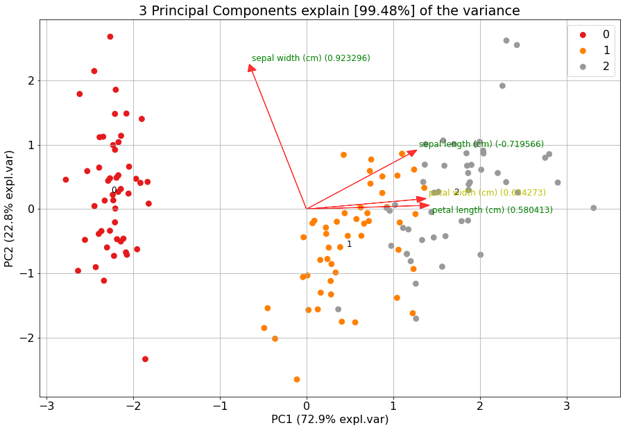

Quickstart
############

A quick example how perform feature reduction using ``pca``.

.. code:: python

	import numpy as np
	from sklearn.datasets import load_iris
	import pandas as pd

	# Load pca
	from pca import pca

	# Load dataset
	label = load_iris().feature_names
	y = load_iris().target
	X = pd.DataFrame(data=load_iris().data, columns=label, index=y)

	# Initialize to reduce the data up to the nubmer of componentes that explains 95% of the variance.
	model = pca(n_components=0.95)

	# Reduce the data towards 3 PCs
	model = pca(n_components=3)

	# Fit transform
	results = model.fit_transform(X)

	# Data looks like this:

	# X=array([[5.1, 3.5, 1.4, 0.2],
	# 	 [4.9, 3. , 1.4, 0.2],
	# 	 [4.7, 3.2, 1.3, 0.2],
	# 	 [4.6, 3.1, 1.5, 0.2],
	# 	 ...
	# 	 [5. , 3.6, 1.4, 0.2],
	# 	 [5.4, 3.9, 1.7, 0.4],
	# 	 [4.6, 3.4, 1.4, 0.3],
	# 	 [5. , 3.4, 1.5, 0.2],
	# 
	# y = [0, 0, 0, 0,...,2, 2, 2, 2, 2]
	# label = ['sepal length (cm)',
	#	 'sepal width (cm)',
	#	 'petal length (cm)',
	#	 'petal width (cm)']

Compute explained variance
************************************

After the ``fit_transform``, the cumulative expained variance is stored together with the explained variance per PC.

.. code:: python

	# Cumulative explained variance
	print(model.results['explained_var'])
	# [0.92461872 0.97768521 0.99478782]

	# Explained variance per PC
	print(model.results['variance_ratio'])
	[0.92461872, 0.05306648, 0.01710261]
	
	# Make plot
	fig, ax = model.plot()

PCs that cover 95% of the explained variance
************************************************************************

The number of PCs can be reduced by setting the ``n_components`` parameter. Note that the number of components can never be larger than the number of variables in your dataset. By setting ``n_components`` **larger than 1**, a feature reduction will be performed to exactly that number of components. By setting ``n_components`` **smaller than 1**, it describes the percentage of explained variance that needs to be covered at least. Or in other words, by setting ``n_components=0.95``, the number of components are extracted that cover at least 95% of the explained variance.

.. code:: python

	# Reduce the data towards 3 PCs
	model = pca(n_components=3)

	# The number of components are extracted that cover at least 95% of the explained variance.
	model = pca(n_components=0.95)

Scatter plot
******************

.. code:: python

	# 2D plot
	fig, ax = model.scatter()

	# 3d Plot
	fig, ax = model.scatter3d()

.. |figE2| image:: ../figs/fig_scatter3d.png

.. table:: Color on alcohol
   :align: center

   +----------+----------+
   | |figE1|  | |figE2|  |
   +----------+----------+

Biplot
******************

.. code:: python
	
	# 2D plot
	fig, ax = model.biplot(n_feat=4, PC=[0,1])

	# 3d Plot
	fig, ax = model.biplot3d(n_feat=2, PC=[0,1,2])

Demonstration of feature importance
#####################################################

This example is created to showcase the working of extracting features that are most important in a PCA reduction.
We will create random variables with increasingly more variance. The first feature (f1) will have most of the variance, followed by feature 2 (f2) etc.

.. code:: python

	# Print the top features.
	print(model.results['topfeat'])

	# Import libraries
	import numpy as np
	import pandas as pd
	from pca import pca

	# Lets create a dataset with features that have decreasing variance. 
	# We want to extract feature f1 as most important, followed by f2 etc
	f1=np.random.randint(0,100,250)
	f2=np.random.randint(0,50,250)
	f3=np.random.randint(0,25,250)
	f4=np.random.randint(0,10,250)
	f5=np.random.randint(0,5,250)
	f6=np.random.randint(0,4,250)
	f7=np.random.randint(0,3,250)
	f8=np.random.randint(0,2,250)
	f9=np.random.randint(0,1,250)

	# Combine into dataframe
	X = np.c_[f1,f2,f3,f4,f5,f6,f7,f8,f9]
	X = pd.DataFrame(data=X, columns=['f1','f2','f3','f4','f5','f6','f7','f8','f9'])

	# Initialize and keep all PCs
	model = pca()
	# Fit transform
	out = model.fit_transform(X)

	# Print the top features.
	print(out['topfeat'])

	# The results show the expected results: f1 is the best, followed by f2 etc
	#     PC      feature
	# 0  PC1      f1
	# 1  PC2      f2
	# 2  PC3      f3
	# 3  PC4      f4
	# 4  PC5      f5
	# 5  PC6      f6
	# 6  PC7      f7
	# 7  PC8      f8
	# 8  PC9      f9

Explained variance plot
****************************

.. code:: python

	model.plot()

.. image:: ../figs/explained_var_1.png
   :width: 600
   :align: center

Biplot
****************************

Make the biplot. It can be nicely seen that the first feature with most variance (f1), is almost horizontal in the plot, whereas the second most variance (f2) is almost vertical. This is expected because most of the variance is in f1, followed by f2 etc. Biplot in 3d. Here we see the nice addition of the expected f3 in the plot in the z-direction.

.. code:: python

	# 2d plot
	ax = model.biplot(n_feat=10, legend=False)

	# 3d plot
	ax = model.biplot3d(n_feat=10, legend=False)

.. |figA1| image:: ../figs/biplot2d.png
.. |figA2| image:: ../figs/biplot3d.png

.. table:: Color on alcohol
   :align: center

   +----------+----------+
   | |figA1|  | |figA2|  |
   +----------+----------+

Analyzing Discrete datasets
#####################################################

Analyzing datasets that have continuous and catagorical values can be challanging.
To demonstrate how to do this, I will use the Titanic dataset. We need to pip install df2onehot first.

.. code:: bash

	pip install df2onehot

.. code:: python

	import pca
	# Import example
	df = pca.import_example()

	# Transform data into one-hot
	from df2onehot import df2onehot
	y = df['Survived'].values
	del df['Survived']
	del df['PassengerId']
	del df['Name']
	out = df2onehot(df)
	X = out['onehot'].copy()
	X.index = y

	from pca import pca

	# Initialize
	model1 = pca(normalize=False, onehot=False)
	# Run model 1
	model1.fit_transform(X)
	# len(np.unique(model1.results['topfeat'].iloc[:,1]))
	model1.results['topfeat']
	model1.results['outliers']

	model1.plot()
	model1.biplot(n_feat=10)
	model1.biplot3d(n_feat=10)
	model1.scatter()
	model1.scatter3d()

	from pca import pca
	# Initialize
	model2 = pca(normalize=True, onehot=False)
	# Run model 2
	model2.fit_transform(X)
	model2.plot()
	model2.biplot(n_feat=4)
	model2.scatter()
	model2.biplot3d(n_feat=10)

	# Set custom transparency levels
	model2.biplot3d(n_feat=10, alpha=0.5)
	model2.biplot(n_feat=10, alpha=0.5)
	model2.scatter3d(alpha=0.5)
	model2.scatter(alpha=0.5)

	# Initialize
	model3 = pca(normalize=False, onehot=True)
	# Run model 2
	_=model3.fit_transform(X)
	model3.biplot(n_feat=3)

Map unseen datapoints into fitted space
##############################################

After fitting variables into the new principal component space, we can map new unseen samples into this space too. However, there is also normalization step which can be tricky because you now need standardize the values of the unseen samples first based on the previously performed standardization. This step is also integrated in the ``pca`` library by simply setting the parameter ``normalize=True``.

.. code:: python

	# Load libraries
	import matplotlib.pyplot as plt
	from sklearn import datasets
	import pandas as pd
	from pca import pca

	# Load dataset
	data = datasets.load_wine()
	X = data.data
	y = data.target.astype(str)
	col_labels = data.feature_names

	# Initialize with normalization and take the number of components that covers at least 95% of the variance.
	model = pca(n_components=0.95, normalize=True)

	# Get some random samples across the classes
	idx=[0,1,2,3,4,50,53,54,55,100,103,104,105, 130, 150]
	X_unseen = X[idx, :]
	y_unseen = y[idx]

	# Label original dataset to make sure the check which samples are overlapping
	y[idx]='unseen'

	# Fit transform
	model.fit_transform(X, col_labels=col_labels, row_labels=y)

	# Transform new "unseen" data. Note that these datapoints are not really unseen as they are readily fitted above.
	# But for the sake of example, you can see that these samples will be transformed exactly on top of the orignial ones.
	PCnew = model.transform(X_unseen)

	# Plot PC space
	fig, ax = model.scatter(title='Map unseen samples in the existing space.')
	# Plot the new "unseen" samples on top of the existing space
	ax.scatter(PCnew.iloc[:, 0], PCnew.iloc[:, 1], marker='x', s=200)

.. image:: ../figs/wine_mapping_samples.png
   :width: 600
   :align: center

Normalizing out PCs
#########################

Normalize your data using the principal components. As an example, suppose there is (technical) variation in the fist component and you want that out. This function transforms the data using the components that you want, e.g., starting from the 2nd PC, up to the OC that contains at least 95% of the explained variance.

.. code:: python

	print(X.shape)
	(178, 13)

	# Normalize out 1st component and return data
	Xnorm = model.norm(X, pcexclude=[1])

	# The data remains the same samples and variables but the all variance that covered the 1st PC is removed.
	print(Xnorm.shape)
	(178, 13)

	# In this case, PC1 is "removed" and the PC2 has become PC1 etc
	ax = pca.biplot(model, col_labels=col_labels, row_labels=y)

Colors in plots
#########################

The default colors that are used in the plots depend on how much information is provided at start.
There are many parameters to change the colors in the plots. Here I will demonstrate some of the possibilities.

First, we will load the data and import the libraries.

.. code:: python

	# Import iris dataset and other required libraries
	from sklearn.datasets import load_iris
	import pandas as pd
	import matplotlib as mpl
	import colourmap

	# Import pca
	from pca import pca
	
	# Class labels
	y = load_iris().target

	# Initialize pca
	model = pca(n_components=3, normalize=True)
	# Dataset
	X = pd.DataFrame(index=y, data=load_iris().data, columns=load_iris().feature_names)
	# Fit transform
	out = model.fit_transform(X)

Lets start with the default plot using hte classlabels (y), and change it using a custom cmap.

.. code:: python

	# The default setting is to color on classlabels (y). These are provided as the index in the dataframe.
	model.biplot()

	# Use custom cmap for classlabels (as an example I explicitely provide three colors).
	model.biplot(cmap=mpl.colors.ListedColormap(['green', 'red', 'blue']))

.. |figE4| image:: ../figs/color_cmap.png

.. table:: Left: Default plot using the provided classlabels. Right: Color on custom cmap.
   :align: center

   +----------+----------+
   | |figE3|  | |figE4|  |
   +----------+----------+

If you want to highlight some samples in the graph, you easily change the classlabels.
The colors are automatically created using the specified colormap. However, this can cause that
the points of interest can still be difficult to find. Therefore it is also possible to set the
input colors for each sample manually.

.. code:: python

	# Set custom classlabels. Coloring is based on the input colormap (cmap).
	y[10:15]=4
	model.biplot(labels=labels, cmap='Set2')

	# Set custom classlabels and also use custom colors.
	c = colourmap.fromlist(labels, cmap='Set2')[0]
	c[10:15] = [0,0,0]
	model.biplot(labels=labels, c=c)

.. |figE5| image:: ../figs/color_cmap_y.png
.. |figE6| image:: ../figs/color_using_custom_colors.png

.. table:: Left: Mark some points on y and use cmap. Right: Specify the colors manually.
   :align: center

   +----------+----------+
   | |figE5|  | |figE6|  |
   +----------+----------+

The highlight the loadings, all scatterpoints can be removed by setting the cmap to None.

.. code:: python
	
	# Remove scatterpoints by setting cmap=None
	model.biplot(cmap=None)

	# Gradient with white ending using the cmap setting.
	model.biplot(labels=labels, gradient='#ffffff', cmap=mpl.colors.ListedColormap(['green', 'red', 'blue']))

.. |figE7| image:: ../figs/color_no_scatter.png
.. |figE8| image:: ../figs/color_gradient.png

.. table:: Left: Remove scatterpoints from plot. Right: Gradient with the used cmap.
   :align: center

   +----------+----------+
   | |figE7|  | |figE8|  |
   +----------+----------+

It is also possible to input a fig as parameter to the plot.
This will allow to make iterative changes.

.. code:: python
	
	from sklearn.datasets import make_friedman1
	X, _ = make_friedman1(n_samples=200, n_features=30, random_state=0)

	# Init
	model = pca()
	# Fit
	model.fit_transform(X)

	# Make plot with blue arrows and text
	fig, ax = model.biplot(c=[0,0,0], s=25, fontdict={'size':10, 'weight':'normal'}, color_arrow='blue', title=None, hotellingt2=True, n_feat=10, visible=True)

	# Use the existing fig and create new edits such red arrows for the first three loadings. Also change the font sizes.
	fig, ax = model.biplot(c=[0,0,0], s=25, fontdict={'size':16, 'weight':'bold'}, color_arrow='red', n_feat=3, title='updated fig.', visible=True, fig=fig)

.. |figE9| image:: ../figs/fig_iterative_changes.png

.. table:: Fig as input to make iterative changes.
   :align: center

   +----------+
   | |figE9|  |
   +----------+

.. include:: add_bottom.add