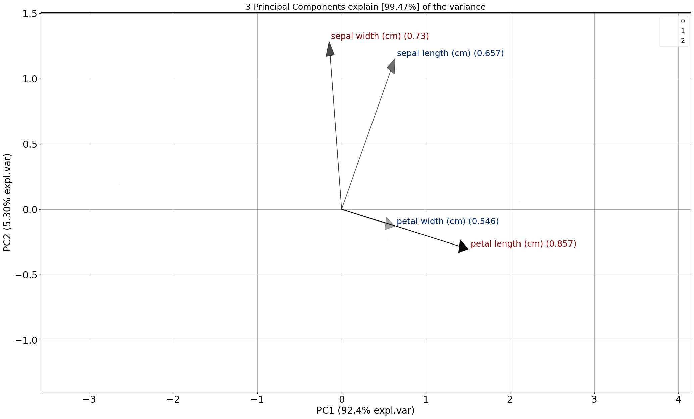
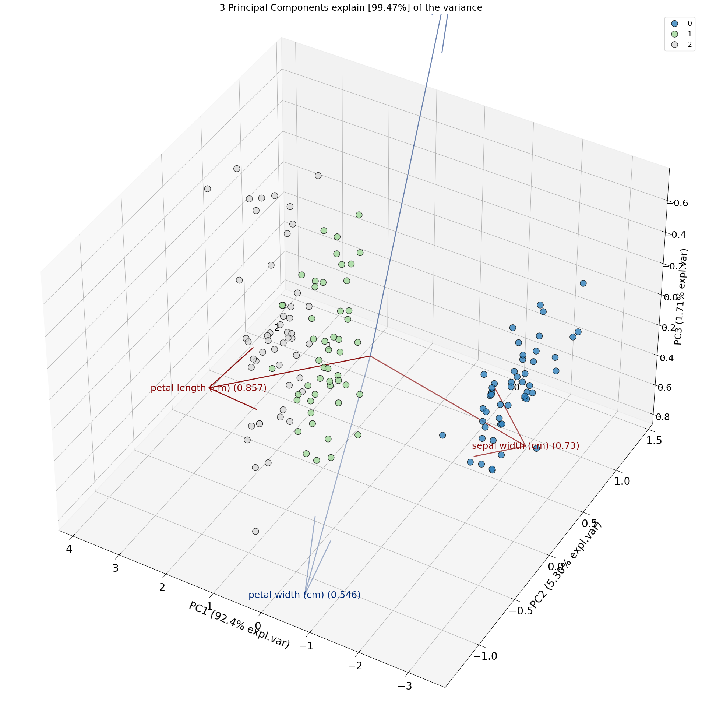

Control Arrows
###############

.. code:: python

	# Load pca
	from pca import pca

	# Initialize pca
	model = pca(n_components=3)

	# Load example data set
	df = model.import_example(data='iris')

	# Fit transform
	results = model.fit_transform(df)

.. code:: python

	# Loading are automatically set based on weak/strong
	model.biplot(s=0)

.. image:: ../figs/wine_arrow_1.png
   :width: 600
   :align: center

.. code:: python

	# Change strong and weak colors
	model.biplot(s=0, arrowdict={'color_strong': 'r', 'color_weak': 'g'})

.. image:: ../figs/wine_arrow_2.png
   :width: 600
   :align: center

.. code:: python

	# Set alpha to constant value
	model.biplot(s=0, arrowdict={'alpha': 0.8})

.. image:: ../figs/wine_arrow_3.png
   :width: 600
   :align: center

.. code:: python

	# Change arrow text color
	model.biplot(s=0, arrowdict={'color_text': 'k'})

.. image:: ../figs/wine_arrow_4.png
   :width: 600
   :align: center

.. code:: python

	# Change arrow color, which automatically changes the label color too
	model.biplot(s=0, color_arrow='k')

.. code:: python

	# Set color text
	model.biplot(s=0, arrowdict={'color_text': 'k'})

.. image:: ../figs/wine_arrow_7.png
   :width: 600
   :align: center

.. code:: python

	# Set color arrow and color text
	model.biplot(s=0, color_arrow='k', arrowdict={'color_text': 'g'})

.. image:: ../figs/wine_arrow_8.png
   :width: 600
   :align: center

.. code:: python

	# Set color arrow and color text and alpha
	model.biplot()

.. image:: ../figs/wine_arrow_9.png
   :width: 600
   :align: center

.. code:: python

	# Change the scale factor of the arrow
	model.biplot3d(arrowdict={'scale_factor': 3})

.. include:: add_bottom.add