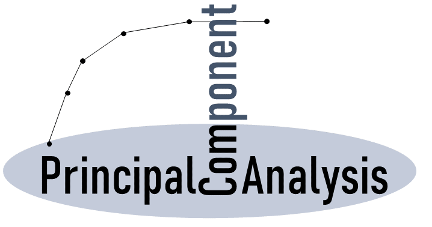

.. _logo:

-------------------------------------

|python| |pypi| |docs| |LOC| |downloads_month| |downloads_total| |license| |forks| |open issues| |project status| |medium| |colab| |donate|

**PCA** is a python package to perform *Principal Component Analysis* and to create insightful *plots*.
The core of PCA is build on **sklearn** functionality to find maximum compatibility when combining with other packages.
But this pca package can do a lot more. Besides the regular **Principal Components**, it can also perform **SparsePCA**, **TruncatedSVD**, and provide you with the information that can be extracted from the components. 

Summary of Functionalities:
  * Biplot to plot the loadings.
  * Determine the explained variance.
  * Extract the best performing features.
  * Scatter plot with the loadings.
  * Outlier detection using Hotelling T2 and/or SPE/Dmodx.

.. tip::
	`Read more details and the usage in the Medium Blog: What are PCA loadings and Biplots? <https://towardsdatascience.com/what-are-pca-loadings-and-biplots-9a7897f2e559>`_

Contents
========

.. toctree::
   :maxdepth: 1
   :caption: Background
   
   Abstract

.. toctree::
   :maxdepth: 1
   :caption: Installation
   
   Installation

.. toctree::
  :maxdepth: 1
  :caption: Methods

  Algorithm

.. toctree::
  :maxdepth: 1
  :caption: Outlier detection

  Outlier detection

.. toctree::
  :maxdepth: 1
  :caption: Plots

  Plots

.. toctree::
  :maxdepth: 1
  :caption: Examples

  Examples
  notebook

.. toctree::
  :maxdepth: 1
  :caption: Documentation
  
  Documentation
  Additional_Information
  Coding quality
  pca.pca

Indices and tables
==================

* :ref:`genindex`
* :ref:`modindex`
* :ref:`search`

.. raw:: html

	

	

		
	

	

.. |python| image:: https://img.shields.io/pypi/pyversions/pca.svg
    :alt: |Python
    :scale: 100%
    :target: https://erdogant.github.io/pca/

.. |pypi| image:: https://img.shields.io/pypi/v/pca.svg
    :alt: |Python Version
    :scale: 100%
    :target: https://pypi.org/project/pca/

.. |docs| image:: https://img.shields.io/badge/Sphinx-Docs-blue.svg
    :alt: Sphinx documentation
    :scale: 100%
    :target: https://erdogant.github.io/pca/

.. |LOC| image:: https://sloc.xyz/github/erdogant/pca/?category=code
    :alt: lines of code
    :scale: 100%
    :target: https://github.com/erdogant/pca

.. |downloads_month| image:: https://static.pepy.tech/personalized-badge/pca?period=month&units=international_system&left_color=grey&right_color=brightgreen&left_text=PyPI%20downloads/month
    :alt: Downloads per month
    :scale: 100%
    :target: https://pepy.tech/project/pca

.. |downloads_total| image:: https://static.pepy.tech/personalized-badge/pca?period=total&units=international_system&left_color=grey&right_color=brightgreen&left_text=Downloads
    :alt: Downloads in total
    :scale: 100%
    :target: https://pepy.tech/project/pca

.. |license| image:: https://img.shields.io/badge/license-MIT-green.svg
    :alt: License
    :scale: 100%
    :target: https://github.com/erdogant/pca/blob/master/LICENSE

.. |forks| image:: https://img.shields.io/github/forks/erdogant/pca.svg
    :alt: Github Forks
    :scale: 100%
    :target: https://github.com/erdogant/pca/network

.. |open issues| image:: https://img.shields.io/github/issues/erdogant/pca.svg
    :alt: Open Issues
    :scale: 100%
    :target: https://github.com/erdogant/pca/issues

.. |project status| image:: http://www.repostatus.org/badges/latest/active.svg
    :alt: Project Status
    :scale: 100%
    :target: http://www.repostatus.org/#active

.. |medium| image:: https://img.shields.io/badge/Medium-Blog-green.svg
    :alt: Medium Blog
    :scale: 100%
    :target: https://towardsdatascience.com/what-are-pca-loadings-and-biplots-9a7897f2e559

.. |donate| image:: https://img.shields.io/badge/Support%20this%20project-grey.svg?logo=github%20sponsors
    :alt: donate
    :scale: 100%
    :target: https://erdogant.github.io/pca/pages/html/Documentation.html#

.. |colab| image:: https://colab.research.google.com/assets/colab-badge.svg
    :alt: Colab example
    :scale: 100%
    :target: https://erdogant.github.io/pca/pages/html/Documentation.html#colab-notebook

