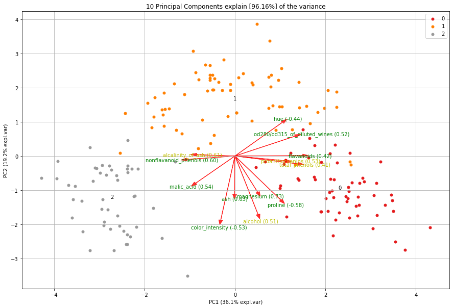

pca's documentation!
========================

``pca`` is a python package to perform *Principal Component Analysis* and to create insightful *plots*. The core of PCA is build on **sklearn** functionality to find maximum compatibility when combining with other packages. But this package can do a lot more. Besides the regular **Principal Components**, it can also perform **SparsePCA**, **TruncatedSVD**, and provide you with the information that can be extracted from the components. 

.. |figD2| image:: ../figs/wine_biplot_with_outliers.png

.. table:: Biplots
   :align: center

   +----------+----------+
   | |figD1|  | |figD2|  |
   +----------+----------+

Functionalities of PCA are:

	* Biplot to plot the loadings
	* Determine the explained variance
	* Extract the best performing features
	* Scatter plot with the loadings
	* Outlier detection using Hotelling T2 and/or SPE/Dmodx

..	tip::
	`Read more details and the usage in the Medium Blog: What are PCA loadings and Biplots? <https://towardsdatascience.com/what-are-pca-loadings-and-biplots-9a7897f2e559>`_

You contribution is important
==============================
If you ❤️ this project, **star** this repo at the `github page <https://github.com/erdogant/pca/>`_ and have a look at the `sponser page <https://erdogant.github.io/pca/pages/html/Documentation.html>`_!

Github
======
Please report bugs, issues and feature extensions at `github <https://github.com/erdogant/pca/>`_.

Content
=======

.. toctree::
   :maxdepth: 1
   :caption: Background
   
   Abstract

.. toctree::
   :maxdepth: 1
   :caption: Installation
   
   Installation

.. toctree::
  :maxdepth: 1
  :caption: Methods

  Algorithm

.. toctree::
  :maxdepth: 1
  :caption: Outlier detection

  Outlier detection

.. toctree::
  :maxdepth: 1
  :caption: Plots

  Plots

.. toctree::
  :maxdepth: 1
  :caption: Examples

  Examples
  notebook

.. toctree::
  :maxdepth: 1
  :caption: Documentation
  
  Documentation
  Additional_Information
  Coding quality
  pca.pca

Indices and tables
==================

* :ref:`genindex`
* :ref:`modindex`
* :ref:`search`

.. raw:: html

	

	

		
	

	

